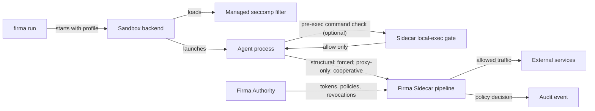
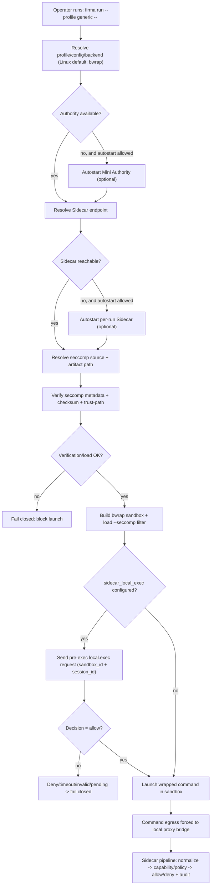

`firma run` launches an agent through a runtime backend and routes outbound calls through the Sidecar. On structural backends, such as Linux `bwrap`, the backend removes the agent's ability to bypass that route. On current macOS `vz` and Windows/WSL2 `wsl2`, enforcement is proxy-only compatibility mode: useful for cooperative agents, but not a hard network boundary. This guide shows you how to use `firma run`, and when you should reach for it instead of plain proxy env vars.



You should already have a Sidecar running with a capability for some agent identity (see [Run the sidecar standalone](../run-the-sidecar/) and [Issue capability tokens](../issue-capability-tokens/)).

## When `firma run` is the right tool

Reach for `firma run` when one or more of these is true:

- The agent is third-party code or runs prompts you don't fully control (most LLM agents).
- You want a hard guarantee that nothing escapes the policy boundary, and you are using a structural backend.
- The agent might spawn child processes that don't inherit env vars, and you are using a structural backend.
- You're shipping a managed runtime to others and want enforcement to be part of the product.

For development work, a Sidecar you wrote, or a CI script you trust, plain proxy env vars are fine. For everything else, `firma run` is the right wrapper, but the backend determines whether the routing is mandatory or proxy-only.

For the conceptual background, read [The sandbox boundary](../../concepts/sandbox/).

## Step 1: Pick a backend

`firma run` uses a different sandbox backend per platform. The defaults are usually right:

| Platform | Default backend | Notes |
| -------- | --------------- | ----- |
| Linux    | `bwrap`         | Structural mode; requires unprivileged user namespaces + AppArmor allowance for bwrap. |
| macOS    | `vz`            | Default compatibility mode: host process, `sandbox-exec`, proxy bridge, explicit `--allow-non-structural` opt-in. Experimental structural modes are available via sandbox-exec network-deny or the VZ guest runner contract. |
| Windows  | `wsl2`          | Current compatibility mode; explicit `--allow-non-structural` opt-in. |

Verify the platform default works on your host. On Linux, the bwrap backend
needs two things: unprivileged user namespaces enabled, and — on AppArmor
distros — permission for bwrap to keep `CAP_NET_ADMIN` inside the namespace
so it can bring up loopback.

```bash
unshare --user --pid echo ok                # user namespaces
bwrap --unshare-net --bind / / true         # bwrap + net namespace
```

If the first command prints `ok` but the second exits with `bwrap: loopback:
Failed RTM_NEWADDR: Operation not permitted`, you're on a distro with
AppArmor restricting unprivileged user namespaces (Ubuntu 24.04 ships this
on by default). See [Common gotchas](#common-gotchas) below for the fix.

If `unshare --user --pid echo ok` itself fails with a permission error,
enable unprivileged user namespaces (`sysctl -w kernel.unprivileged_userns_clone=1`
on some distros) or pick a different backend.

On macOS and WSL, `firma run` defaults to compatibility mode and fails closed unless you acknowledge the weaker boundary with `--allow-non-structural` or `run.allow_non_structural = true`. On WSL, `firma run` does not implicitly select `bwrap`; it automatically selects the `wsl2` compatibility backend.

macOS structural modes are explicit opt-ins:

```bash
# Intermediate: block external IP egress with sandbox-exec, loopback remains reachable.
FIRMA_RUN_VZ_STRUCTURAL_NETWORK=1 firma run --profile generic -- curl https://example.com

# Stronger target: launch through an operator-provided Virtualization.framework runner.
FIRMA_RUN_VZ_GUEST=1 \
FIRMA_RUN_VZ_GUEST_RUNNER=/Applications/Firma/vz-runner \
FIRMA_RUN_VZ_GUEST_KERNEL=/var/lib/firma/vz/vmlinuz \
FIRMA_RUN_VZ_GUEST_INITRD=/var/lib/firma/vz/initrd.img \
FIRMA_RUN_VZ_GUEST_ROOTFS=/var/lib/firma/vz/rootfs.img \
firma run --profile generic -- curl https://example.com
```

Guest mode validates those artifact paths, writes `vz-guest-launch.json` under the run directory, and spawns the runner with `--launch-contract`. The runner is responsible for the Apple Virtualization.framework lifecycle and for enforcing the contract inside the guest.

## Step 2: Scaffold a config directory with `firma config`

`firma config` creates a complete working configuration directory — sidecar + authority config, Cedar policy, mapping rules, and an authority keypair — in a single step:

```bash
firma config --name my-agent --posture dev --mapping anthropic
```

This writes to the **current directory** by default. To write to a specific directory, pass `--output-dir`:

```bash
firma config --name my-agent --posture dev --mapping anthropic --output-dir .local
```

Generated layout (default `--output-dir .firma`):

```
.firma/
  firma.toml                   — unified config (authority + sidecar + run profiles)
  mapping-rules.toml           — base mapping rules
  mappings/anthropic.toml      — Anthropic endpoint mapping
  policies/dev.cedar           — Cedar enforcement policy
  issuance-policies/issuance.cedar

$XDG_DATA_HOME/firma/          — platform state dir (keys, revocations, CA)
  authority.key                — authority signing keypair (preserved on re-run)
  audit.key                    — demo audit signing key
  revocations.txt
```

`firma config` is idempotent — re-running preserves existing files including the authority keypair; pass `--force` to overwrite everything. Skip all interactive prompts with `--yes`. Preview without writing:

```bash
firma config --dry-run
```

Inspect the generated config:

```bash
cat firma.toml
```

## Step 3: Run with Per-Run Sidecar (Default)

With `--sidecar local` (also the default when no sidecar endpoint is configured), `firma run` always starts a per-run
Sidecar alongside the agent process, waits for readiness, and tears it down
on exit.

The simplest invocation:

```bash
cargo run --release -p firma -- run --profile generic -- curl https://example.com
```

If you use a coding-agent profile:

```bash
cargo run --release -p firma -- run --profile codex -- codex
```

### Optional: run a Sidecar manually (`--sidecar <url>`)

Manual sidecar startup is only needed when you explicitly choose external mode
or operate with a pre-managed sidecar (systemd / `firma sidecar start`).

In a dedicated terminal:

```bash
firma sidecar -c .firma/firma.toml
```

Wait for the `sidecar ready` line.

Opt out for production or CI:

- `--no-autostart` — fail with a typed `MissingSidecar` / `SidecarUnreachable` error instead of spawning a child Sidecar.
- `--sidecar tcp://host:port` / `--sidecar unix:///path` — point at an external sidecar (systemd-managed or `firma sidecar start`); never autostarts.

Autostart currently requires Unix. On Windows, use `--sidecar <url>` with a pre-started Sidecar.

### Authority bootstrap

Before the Sidecar starts, `firma run` resolves which Authority to use.
Precedence:

1. `--authority local` / `--authority <url>` — CLI override.
2. `[authority]` section present in the discovered `firma.toml`
   (walk-up from the current directory to `<dir>/.firma/firma.toml`, or
   `$FIRMA_CONFIG`) — autostart a local Mini Authority.
3. `[sidecar.authority].url` set — connect to that remote Authority.
4. Nothing configured — `firma run` falls back to local autostart so
   zero-config works. The spawned Authority uses an ephemeral signing
   key and a per-run loopback listen address; it is killed on
   `firma run` exit. `--no-autostart` overrides this to fail with
   `MissingAuthority`.

Flags:

- `--authority local` — autostart a local Mini Authority on
  a per-run loopback ephemeral port; overrides config.
- `--authority <url>` — point at a remote Authority; overrides config;
  fails with `AuthorityUnreachable` if the URL does not answer.
- `--authority-profile <name>` — profile materialised by the
  autostarted Mini Authority. Today only `developer` ships. Ignored
  when the Authority is remote or already reachable.

`--no-autostart --authority local` is a typed argument-conflict error.

### Autostart startup notices

`firma run` logs a structured `INFO` line to stderr for every autostart and reuse event so you can see exactly what was started, at what address, and under which run ID. With the default log filter (`info`), you will see lines like:

```
2026-05-27T10:00:01Z  INFO firma_run::authority::supervisor: authority started
    sandbox_id="01970def" pid=84231 listen_addr="[::1]:54321"

2026-05-27T10:00:02Z  INFO firma_run::sidecar::supervisor: sidecar started
    sandbox_id="01970def" pid=84235 endpoint="127.0.0.1:18080"
```

If a local authority was already reachable before the run, you see an `INFO` instead:

```
2026-05-27T10:00:01Z  INFO firma_run::routing: authority reused: existing local authority on plaintext loopback
    sandbox_id="01970def" url="http://[::1]:50051"
```

On exit, each autostarted component logs a stopping notice:

```
2026-05-27T10:00:10Z  INFO firma_run::sidecar::supervisor: sidecar stopped pid=84235
2026-05-27T10:00:10Z  INFO firma_run::authority::supervisor: authority stopped pid=84231
```

**Key fields:**

| Field | Meaning |
|---|---|
| `sandbox_id` | UUIDv7 run identifier — unique per `firma run` invocation |
| `pid` | OS process ID of the autostarted component |
| `listen_addr` / `endpoint` | Address the component is reachable at |
| `url` | Full URL (authority reuse path) |

**Controlling log visibility:**

Log output goes to stderr by default. Use `--log-filter` (or `FIRMA_LOG_FILTER`) to adjust verbosity. Use `--log-file` (or `FIRMA_LOG_FILE`) to redirect logs to a file:

```bash
# Quiet: suppress info, keep warnings
firma run --log-filter warn -- my-agent

# Redirect to file (startup notices go to the file, not the terminal)
firma run --log-file /tmp/firma.log -- my-agent
```

## Step 4: What `firma run` does

Everything after `--` is the command and its arguments.

On structural backends, `firma run`:

1. Resolves the `generic` profile.
2. Builds a sandbox using the platform default backend.
3. Starts the in-sandbox proxy bridge listening on `127.0.0.1:18080`.
4. Sets `HTTP_PROXY=http://127.0.0.1:18080` (and the HTTPS variant).
5. Launches `curl https://example.com` inside the sandbox under a sandbox identity.

The Sidecar receives the curl's request, runs it through the pipeline, and either dispatches or denies. With sidecar-seeded capabilities, the `curl` invocation never sees a token; it just talks to the proxy. If you use `--capability-file`, current `firma run` exports capability material into the wrapped process environment for compatibility, so do not use that mode when token non-exposure is a hard requirement.

On current macOS `vz` and Windows/WSL2 `wsl2`, `firma run` instead starts a host-side proxy bridge, injects proxy environment variables, clears `NO_PROXY`, and refuses to launch unless non-structural mode is explicitly allowed. A cooperative HTTP client is mediated and audited; a non-cooperative client can still bypass by ignoring proxy variables or opening direct sockets. The runtime logs this as a `backend compatibility proof`, not a structural proof.

## `firma run` execution flow (Linux: `bwrap` + seccomp + Sidecar governance)



Flow references:

- Linux local-command architecture: `docs/architecture/linux-local-command-enforcement.md`
- Local-exec request/response contract: `docs/architecture/command-governance-local-exec-contract.md`
- `firma run` autostart + flags + typed errors: `docs/cli.md` (`## firma run`)
- Runtime launcher implementation: `crates/firma/src/services/run.rs`
- `firma-run` runtime orchestration: `crates/firma-run/src/runtime.rs`
- Linux backend (`bwrap`): `crates/firma-run/src/backend/linux_bwrap.rs`
- Seccomp artifact verify/load path: `crates/firma-run/src/seccomp.rs`
- Local-exec mediator client: `crates/firma-run/src/mediator.rs`
- Sidecar local-exec endpoint: `crates/firma-sidecar/src/local_exec/endpoint.rs`

## Step 5: Use the right capability

For Stage 1 to allow the call, the Sidecar must have a capability matching `(session_id, action_class, resource)`. Two options:

**Pre-staged capability seed.** Issue a capability once with `firma authority issue --output .local/capability-<agent>.toml` and reference it in `[sidecar.capability_seed].paths` in `firma.toml`. Right for a long-lived dev workflow.

**Per-run capability.** Pass `--capability-file` to `firma run`. The wrapper writes the file to a host-side path the Sidecar reads. Right for one-off invocations.

```bash
firma authority -c .firma/firma.toml issue \
  --agent-id local-dev \
  --session-id $(uuidgen) \
  --action communication.external.send \
  --output .firma/capability-local-dev.toml

firma run \
  --config .firma/firma.toml \
  --profile generic \
  --capability-file .firma/capability-local-dev.toml \
  -- curl https://example.com
```

## Step 6: Inspect the effective config

Before you trust a `firma run` invocation in production, see what it's actually going to do:

```bash
firma run --profile generic --print-effective-config -- echo hi
```

This prints the resolved profile as JSON: which backend, which env vars are injected, which mounts are visible inside the sandbox, which identity remap applies. No agent is launched. Use this to audit your wrapper config the same way you'd `terraform plan` infrastructure.

## Useful flags

`firma run --help` is the full reference. The flags that come up most often:

| Flag                                        | Effect                                                                                                                                                                                     |
| ------------------------------------------- | ------------------------------------------------------------------------------------------------------------------------------------------------------------------------------------------ |
| `--profile <name>`                          | Pick a runtime profile. `generic` is the default; `codex` adds workspace mounts for coding agents.                                                                                         |
| `--config <file>`                           | Override profile defaults from a TOML/YAML file.                                                                                                                                           |
| `--backend <bwrap\|vz\|wsl2\|firecracker>`  | Override the platform default backend.                                                                                                                                                     |
| `--sidecar <local\|url>`                    | `local` autostarts a per-run Sidecar; a `tcp://host:port` / `unix:///path` value targets an external one and never autostarts. Omitted: persisted `sidecar_endpoint` else local autostart. |
| `--no-autostart`                            | Disable autostart for any missing component and fail loudly. Incompatible with `--sidecar local` and `--authority local`. CI / production safety net.                                      |
| `--sidecar-config <path>`                   | Sidecar TOML template for autostart. Falls back to `FIRMA_SIDECAR_CONFIG_FILE`, then the discovered `firma.toml`.                                                                          |
| `--sidecar-startup-timeout-secs <n>`        | Maximum wait for the autostarted Sidecar's `ready` line (default `10`).                                                                                                                    |
| `--capability-file <path>`                  | Pre-staged capability seed for this run.                                                                                                                                                   |
| `--identity-mode <sandbox-user\|host-user>` | Choose whether the sandboxed process runs as the host user or a remapped sandbox user.                                                                                                     |
| `--print-effective-config`                  | Print resolved config and exit. No agent launched.                                                                                                                                         |
| `--monitor`                                 | Run in observe-only mode for this invocation. Every call is allowed through; `firma monitor` shows the original deny reason prefixed with `monitor_mode:`. Never use in production.        |

## What does and does not pass through

On structural backends, the agent sees:

- A loopback interface where only `127.0.0.1:18080` is reachable.
- A DNS stub that answers only the hostnames the Sidecar is configured to route.
- `HTTP_PROXY` and `HTTPS_PROXY` set to the proxy bridge.
- Whatever filesystem the profile mounts (the `generic` profile mounts very little; `codex` mounts a workspace).

It does *not* see:

- The capability token when capabilities are pre-seeded into the host-side Sidecar. Current `--capability-file` mode is an exception and exports capability material into the wrapped process environment.
- Host environment variables (the sandbox starts with a stripped env).
- Host filesystem outside profile-mounted paths.

This means an agent under structural `firma run` cannot:

- Open a raw TCP socket to anything but the proxy bridge.
- Resolve and connect to `8.8.8.8:53` to do its own DNS.
- Spawn a child that bypasses `HTTP_PROXY` (the network namespace forecloses on this regardless).
- Read host files containing secrets.

What it *can* still do is whatever its capability + policy allow it to do *via* the Sidecar. The sandbox is plumbing; the policy is what decides.

On proxy-only compatibility backends, the agent sees proxy variables and `NO_PROXY` clearing, but it does not get a mandatory network namespace or deterministic DNS confinement. That mode is for compatibility and ergonomics; it is not the answer for an adversarial or non-cooperative agent.

## Common gotchas

**`bwrap: setting up uid map: Permission denied`.** Unprivileged user namespaces are disabled on your kernel. Enable them or use another supported backend for your environment.

**`bwrap: loopback: Failed RTM_NEWADDR: Operation not permitted`.** Hits on Ubuntu 24.04 and other distros that ship `kernel.apparmor_restrict_unprivileged_userns=1`. When bwrap enters its unprivileged user namespace, AppArmor transitions it to the `unprivileged_userns` profile, which `audit deny capability` — stripping `CAP_NET_ADMIN`. bwrap then can't add `127.0.0.1/8` to `lo` inside the new netns, and `--unshare-net` fails. Confirm with `sysctl kernel.apparmor_restrict_unprivileged_userns` (expect `1`) and `bwrap --unshare-net --bind / / true` (reproduces the error in isolation). Pick one of:

- **Targeted (recommended):** install an AppArmor profile that lets bwrap keep its caps inside the userns. Create `/etc/apparmor.d/bwrap`:

  ```
  abi <abi/4.0>,
  include <tunables/global>

  profile bwrap /usr/bin/bwrap flags=(unconfined) {
      userns,
      include if exists <local/bwrap>
  }
  ```

  Then `sudo apparmor_parser -r /etc/apparmor.d/bwrap`. This carves out bwrap specifically; other unprivileged-userns users on the host remain restricted.

- **Dev-host shortcut:** turn the restriction off globally. `sudo sysctl -w kernel.apparmor_restrict_unprivileged_userns=0` (persist with a drop-in under `/etc/sysctl.d/`). Fine for a single-user dev VM; do not do this on shared or production hosts — any user can then create unprivileged user namespaces with full caps.

- **Sidestep bwrap:** use a VM-backed mode if one is available in your setup. VM backends don't depend on host AppArmor for namespace setup.

**`firma run` exits immediately with a typed backend/config error.** This is expected when the selected backend is incompatible with the host. On WSL, implicit backend selection uses `wsl2` compatibility mode. On explicit `bwrap` selection with unsupported host conditions (for example WSL or restricted user namespaces), you'll get an `UnsupportedBackend` error with remediation guidance.

**The agent sees `HTTP_PROXY` but its calls still fail with DNS errors on a structural backend.** The DNS stub only answers hosts the Sidecar will route. If your mapping rules don't cover the host, the stub returns NXDOMAIN. Add the host to the mapping (and a permitting rule to the policy).

**Tight loops produce `PolicyDenied`.** A coding agent doing one task per second can blow through `action_count` faster than expected. If your policy gates on `action_count`, raise the threshold or scope the rule more narrowly.

## What's next

- [Secure a local coding agent](../secure-a-coding-agent/) — putting `firma run` to work for Claude Code / Codex / Cursor.
- [Concepts: The sandbox boundary](../../concepts/sandbox/) — for the architectural reasoning.
- [Read & verify the audit log](../audit-log/) — observe what the wrapped agent actually does.
